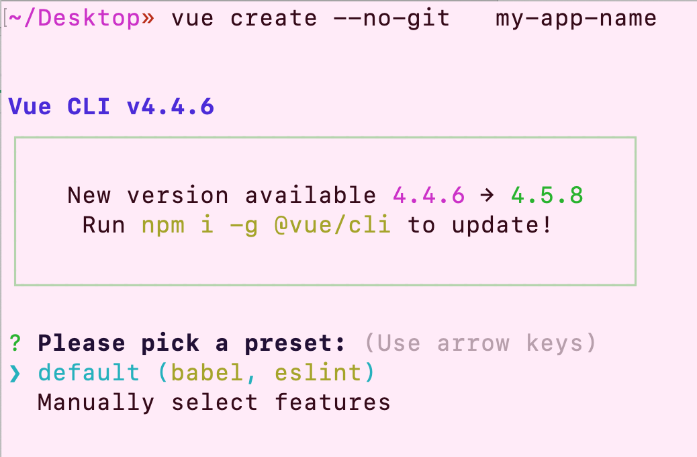

# Assignment 07 - Vue CLI

In the last assignment in lesson06, you created a responsive website with Bootstrap 4. In this assignment, you'll convert those pages and rebuild them with Vue CLI.

### References
- [Vue Docs](https://vuejs.org/v2/guide/)
- [Vue DevTools - Chrome](https://chrome.google.com/webstore/detail/vuejs-devtools/nhdogjmejiglipccpnnnanhbledajbpd?hl=en)
- [Vue DevTools - Firefox](https://addons.mozilla.org/en-US/firefox/addon/vue-js-devtools/)
- Depending on which Bootstrap components you are using, you can choose to just use Bootstrap instead of Bootstrap Vue.  Bootstrap Vue components can be powerful and save you time if you need the functionality.  Choosing Bootstrap over Bootstrap Vue will prevent some extra refactoring that would be needed to get your code snippets from the assignment in lesson 06.
- [Adding Bootstrap to Vue CLI](https://travishorn.com/adding-bootstrap-to-a-vue-cli-project-98c2a30e0ed0)
- [Bootstrap Vue](https://bootstrap-vue.js.org/docs/)

### To get started:
- 	Fetch from the upstream master and merge with your local master as we start each lesson
-	In your forked repo, create a new branch off of master called `lesson-07` or similar
-   Navigate to the root folder of this assignment within terminal in your fork, `lesson07/assignment`
- 	Install the Vue CLI if you haven't already with `npm install -g @vue/cli`
	- 	If installed correctly, running `vue --version` should return a number

###	Create your project using Vue CLI:

-	Follow the instructions in the Vue CLI documentation: https://cli.vuejs.org/guide/creating-a-project.html. Pass the "--no-git" flag to the create command, to prevent it from initializing the new project as a git repository (necessary because the html300 directory is a repository already, and having nested repositories leads to major problems with git).
	- Choose "default" preset, rather than choosing features manually.
	- If the CLI prompts you to choose a Vue version, select Vue 2 and not Vue 3.
	- If you're not sure whether to use npm or yarn, choose npm.

-	Once done, `cd` into the project
- 	Installing scss (in your project directory)
	-	npm command: run `npm install -D sass-loader sass`
	-	yarn command: run `yarn add sass-loader sass`
-	Installing and using Bootstrap (in your project directory)
	-	npm command: run `npm install popper.js`
	-	yarn command: run `yarn add popper.js`
	- Follow the "Getting Started" guide for Bootstrap Vue to make the package available in your project. "Using Module Bundlers" is the applicable section: https://bootstrap-vue.org/docs#using-module-bundlers.
-	You now have access to scss and all of bootstrap/bootstrap-vue. Watch the screencast for more information on using bootstrap-vue components and bootstrap features in Vue, as well as turning the bootstrap nav into an app router
-	In the project's README.md, find instructions to compile and hot reload for development. This will start the development server.

### Build out the Project

- 	Now, convert the 4 pages from lesson06 to components, then set paths in your router to those imported components. Meet the following requirements:
	-	All repeated content must be from variables in the `<script>` part of the `.vue` page, using `v-for` to iterate through and build the content
		- 	This means the content should not be hardcoded, but set in the script and populated on the page with Vue methods
	- 	You must use at least one `v-if` `v-else` statement to change content or UI.
	- 	For the image page, use a `v-for` loop to iterate through an array of images.
	- 	For the accordion page, use a `v-for` to iterate through an object to fill out the content in an accordion.
	-	Use of Vue router to navigate component pages
	- 	Don't forget to add comments to your code explaining Bootstrap 4 classes you added and your VUE code.
- 	**Bonus:**  Use VUE to change the CSS. 
- 	**Extra Bonus:**  Have an input box that changes the content as the user types. 

### To Submit:
- Create a Pull Request for your assignment branch to your forked master
- Submit the link to your pull request in your assignment submission box
- Once assignment is graded, merge the Pull Request
